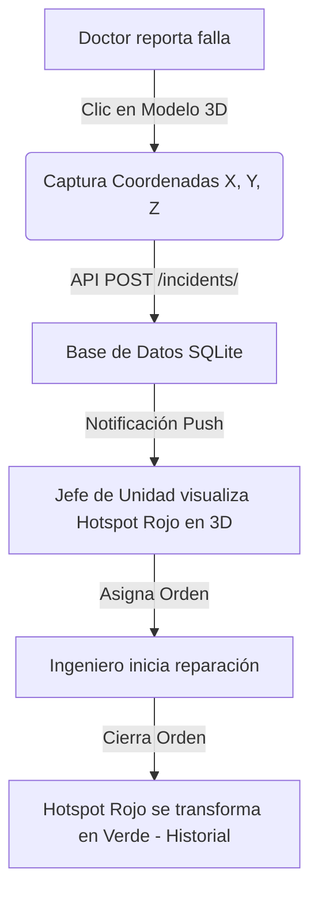

# SISTEMA MEDTRACK: GESTIÓN DE EQUIPAMIENTO MÉDICO Y MANTENIMIENTO HOSPITALARIO
### DOCUMENTO DE ESPECIFICACIÓN TÉCNICA Y DIAGNÓSTICO DE SISTEMA

---

> [!IMPORTANT]
> **REPOSITORIO OFICIAL DEL PROYECTO (GITHUB)**
> El código fuente, historial de versiones y configuraciones de despliegue de este proyecto están alojados en:
> **[https://github.com/MrSabritas96/ProyectoGraficaMultimedia](https://github.com/MrSabritas96/ProyectoGraficaMultimedia)**

---

## 1. Carátula del Proyecto

* **Institución:** Universidad Privada Franz Tamayo (UNIFRANZ)
* **Facultad:** Facultad de Ingeniería
* **Carrera:** Ingeniería de Sistemas
* **Materia:** Gráfica y Multimedia / Aseguramiento de Calidad de Software
* **Proyecto:** Sistema de Gestión de Activos Hospitalarios, Órdenes de Trabajo y Automatización de Calidad (MedTrack)
* **Caso de Estudio:** Unidad de Infraestructura y Mantenimiento Electromedicina de Hospital Central
* **Docente:** Ing. Gabriel Alejandro Choque Callizaya
* **Estudiante:** Alvaro Antonio Diaz Cerda / Christian Manuel Nájera Mendoza
* **Ubicación:** La Paz – Bolivia
* **Año:** 2026

---

## 2. Descripción del Sistema

El proyecto consiste en el desarrollo de **MedTrack**, un sistema de software integral multiplataforma (CMMS - *Computerized Maintenance Management System*) enfocado en la administración del inventario médico, control de órdenes de mantenimiento preventivo y correctivo, y el monitoreo en tiempo real del estado de salud de los activos clínicos. 

El sistema destaca por incorporar un **motor de visualización tridimensional (WebGL)** en el navegador que permite la inspección espacial de los equipos, permitiendo a los ingenieros de soporte localizar visualmente en tres dimensiones el área física exacta de la falla reportada.

### Problema que Resuelve
En la gestión tradicional de la unidad de electromedicina, los reportes de incidentes clínicos y la asignación de mantenimiento se realizan mediante cuadernos, hojas de cálculo aisladas o mensajería informal. Esto ocasiona:
* **Tiempos de inactividad prolongados** en equipos altamente críticos (por ejemplo, tomógrafos, resonadores, ecógrafos), afectando directamente la atención al paciente.
* **Ambigüedad y falta de precisión** al describir verbalmente un fallo técnico en máquinas de alta complejidad física.
* **Ausencia de trazabilidad y auditoría** para conocer qué ingeniero atendió cada orden, qué repuestos se consumieron y cuánto tiempo tomó la resolución.
* **Falta de visibilidad de la disponibilidad técnica** de los ingenieros biomédicos en tiempo real.

### Objetivo Principal
Desarrollar una plataforma digital centralizada y de alta interactividad visual que automatice el flujo de trabajo de mantenimiento técnico. Mediante la integración de un renderizador 3D, autenticación basada en roles, notificaciones push asíncronas y un panel de control automatizado de pruebas de calidad (TQA), el sistema garantiza la disponibilidad operativa del equipamiento médico, optimiza los tiempos de respuesta ante incidentes y provee auditorías de auditoría transaccionales.

---

## 3. Alcance del Desarrollo

El desarrollo del sistema abarca el diseño gráfico interactivo de la interfaz, el motor de rendering 3D, y un panel de control avanzado para pruebas de regresión, carga y calidad de software.

### Funcionalidades Principales
* **Autenticación Multi-Rol:** Flujo diferenciado de accesos para **Administrador**, **Jefe de Unidad**, **Ingeniero**, **Secretario** y **Doctor**.
* **Gestión Geométrica 3D de Activos:** Renderizado interactivo de modelos `.glb` en el navegador con controles orbitales.
* **Módulo de Reportes de Falla Espaciales ("Escena del Crimen"):** Permite al usuario reportar una falla clínica haciendo clic directo sobre la parte física del equipo en el canvas 3D, capturando coordenadas exactas $(X, Y, Z)$ de la alerta.
* **Bandeja Inteligente de Órdenes de Trabajo:** Asignación visual de órdenes de trabajo por parte de los Jefes de Unidad, seleccionando ingenieros según disponibilidad instantánea.
* **Bitácora y Cronómetro de Campo:** Panel especializado para que el ingeniero inicie, registre bitácoras de avance diario y cierre órdenes de trabajo ingresando costos y observaciones.
* **Panel TQA y Motor de Auto-recuperación (Avance del Día):** Dashboard administrativo avanzado para validación automática del sistema, simulación de estrés concurrente, inyección controlada de errores y corrección de código autónoma (Self-Healing) basada en IA.

---

## 4. Componentes Gráficos y Multimedia Propuestos

### 4.1. Dashboard Interactivo de Gestión de Órdenes (Jefe de Unidad)
Un centro de comando digital que incluye widgets estadísticos en tiempo real sobre la "Salud Global del Inventario", gráficos circulares de carga laboral por ingeniero y un **Calendario Interactivo Completo (BigCalendar)** que organiza las actividades programadas en el mes.

### 4.2. Visor Técnico 3D de Equipos (`Equipment3DViewer`)
El canvas interactivo tridimensional integrado en el frontend mediante **Three.js** y **React Three Fiber**.
* **Hotspots de Alerta (Rojos):** Esferas pulsantes en el espacio 3D que denotan fallas activas. Al hacer clic, despliegan el reporte del incidente enviado por el doctor solicitante.
* **Hotspots de Historial (Verdes):** Puntos que representan mantenimientos ya completados con éxito en esa zona de la máquina. Al tocarlos, muestran la fecha de resolución, el ingeniero asignado y las acciones técnicas tomadas.



### 4.3. Panel TQA Avanzado (Vista del Administrador)
Ubicado en `/dashboard/admin/tqa`, es un panel interactivo diseñado para automatizar las pruebas y garantizar la estabilidad del código. Muestra telemetría de ejecución de pruebas y terminales del sistema.

---

## 5. Componentes Multimedia y Diseño Estético

* **Modelos 3D Optimizados:** Archivos `.glb` comprimidos con técnicas *low-poly* para garantizar que el renderizado en la web sea fluido (60 FPS) incluso en dispositivos móviles de gama media.
* **Efectos Sonoros y Multimedia:** El sistema incorpora efectos auditivos en el dashboard (`bg_music.mp3`, `music_on.mp3`, `music_off.mp3`) que pueden ser controlados desde la interfaz de usuario, optimizando el entorno de trabajo del operador técnico.
* **Micro-animaciones de Estado:** Implementación de transiciones de desvanecimiento (*fade-in*, *slide-up*), spinners personalizados basados en la marca institucional y cambios dinámicos de colores según el nivel de urgencia o estado del activo (Verde: Operativo, Amarillo: En Mantenimiento, Rojo: Fuera de Servicio).

---

## 6. Integración de Inteligencia Artificial y Pruebas TQA (Detalle del Avance de Hoy)

> [!NOTE]
> **ÉNFASIS DEL DÍA DE HOY**
> La última jornada de desarrollo estuvo enfocada exclusivamente en la creación e integración del **Motor de Calidad TQA** y las vistas administrativas asociadas. Este componente simula la presencia de un agente de aseguramiento de calidad automatizado interactuando con el backend de Django y el frontend de Next.js.

### 6.1. Suite Automatizada de Pruebas (20 Casos de Prueba)
Se integró una suite completa de pruebas unitarias y de integración en el backend (`TQA/tqa_test_suite.py`) que valida flujos transaccionales clave del negocio.

| Código del Caso | Nombre del Caso de Prueba | Módulo / Categoría | Entrada de Datos (Payload) | Criterio de Aceptación (Aserción) |
| :--- | :--- | :--- | :--- | :--- |
| **TC-01** | Autenticación de Usuarios con Roles | Seguridad y Acceso | Email, Contraseña, Código Único | HTTP 200 OK + JWT Token |
| **TC-02** | Creación de Órdenes de Trabajo | Mantenimiento | ID de equipo, ID de ingeniero | HTTP 201 Created + Estado 'Pendiente' |
| **TC-03** | Cierre de Órdenes con Reporte Técnico | Operación Clínica | ID de orden, Observaciones válidas | HTTP 200 OK + Estado 'Finalizado' |
| **TC-04** | Consulta de disponibilidad de ingenieros | Operación Clínica | JWT del Jefe de Unidad | HTTP 200 OK + Arreglo de estados |
| **TC-05** | Dashboard de Análisis Experto | Reportes y Métricas | JWT de Administrador | HTTP 200 OK + Métricas de costos |
| **TC-08** | **Cierre fallido por falta de observaciones** | Validación Lógica | ID de orden, Observaciones vacías | **HTTP 400 Bad Request** |
| **TC-13** | Registro de orden con Activo inexistente | Robustez | ID de equipo = 999999 | HTTP 400 Bad Request ('No encontrado') |
| **TC-16** | Auditoría transaccional de estados | Seguridad | Transiciones de orden | Registro síncrono en log de auditoría |
| **TC-17** | Restricción de acceso a panel experto | Seguridad | JWT de Secretario / Técnico | HTTP 403 Forbidden |
| **TC-18** | Validación de costo de reparación negativo | Robustez | Costo = -150.00 | HTTP 400 Bad Request |
| **TC-19** | Generación de notificaciones push de fallas | Notificaciones | Registro de incidente | HTTP 200 OK + Alerta en buzón del jefe |
| **TC-20** | Cierre de sesión y revocación JWT | Seguridad | Endpoint Logout + Petición posterior | HTTP 401 Unauthorized |

### 6.2. Inyección de Fallas y Mecanismo IA Self-Healing
El sistema expone una pasarela interactiva de simulación de errores en producción:
1. **Inyectar Fallo:** Mediante un clic en el Panel TQA, se escribe el archivo `fault_injected.txt` en el backend. Esto activa dinámicamente un fallo de regresión en `views.py`, anulando la obligatoriedad de ingresar observaciones técnicas al cerrar una orden (lo que violaría el modelo de datos clínico).
2. **Fallo en Casos de Prueba:** Al correr el diagnóstico, la suite detecta de inmediato el error: el **TC-08** falla (retorna HTTP 200 en lugar del esperado 400 Bad Request) y la tasa de éxito de la suite baja al **95.0%**.
3. **Mecanismo Self-Healing:** Al activar la auto-reparación, un motor inteligente en el backend de Django remueve la bandera de error, restaurando instantáneamente las reglas de validación operacional en el script del servidor. Al re-ejecutar el análisis, la suite se recupera de manera autónoma al **100% de éxito**.

```
[REGRESSION DETECTED] TC-08: Cierre de orden permitió observaciones vacías!
                      Expected status: 400 | Received: 200 OK
                      Initiating AI Self-Healing...
[SELF-HEALING SUCCESS] Restoration of Views.py rules completed.
                      Rerunning suite: 20/20 PASSED. Success Rate: 100%.
```

### 6.3. Generador de Pruebas con Lenguaje Natural (IA Test Gen)
Permite ingresar un requerimiento de negocio en texto plano (ej: *"Validar que un usuario Secretario no pueda ver las métricas de telemetría"*). El motor backend interpreta la instrucción y escribe automáticamente la clase de prueba de integración correspondiente en Python (`unittest`) lista para ser acoplada al sistema de pruebas del servidor.

### 6.4. Simulador de Carga y Estrés (Locust Integration)
Mide el comportamiento de la base de datos relacional y del servidor web bajo uso simultáneo pesado. Permite configurar la cantidad de usuarios virtuales concurrentes (desde 100 hasta 1,000) y reporta la siguiente telemetría en tiempo real:
* **TPS (Transacciones por Segundo):** Indicador de la capacidad de procesamiento de la API.
* **Latencia Promedio:** Tiempo de respuesta medido en milisegundos.
* **DB Concurrency Locks:** Detección de bloqueos de lectura/escritura concurrentes en SQLite3 y su recuperación autónoma mediante reintentos.

---

## 7. Tecnologías Utilizadas

### Frontend (MedTrack Client)
* **Framework:** React con **Next.js** (App Router) para renders optimizados del servidor y enrutamiento dinámico ágil.
* **Lenguaje:** **TypeScript** para tipado seguro en la manipulación de estados.
* **Modelado y Renderizado 3D:** **Three.js** y **React Three Fiber (R3F)** para la manipulación del Canvas tridimensional de equipos.
* **Componentes Visuales:** Tailwind CSS para diseño fluido responsivo en "Modo Oscuro" futurista, y **Lucide-React** para iconografía médica y de calidad.
* **Gestión de Sesiones:** **js-cookie** para almacenar los tokens JWT en el navegador de manera segura.

### Backend (MedTrack Server Core)
* **Framework:** Python con **Django REST Framework (DRF)** para proveer endpoints API REST transaccionales robustos.
* **Base de Datos:** **SQLite3** con serialización avanzada JSON para almacenar listas de incidentes e historiales médicos detallados.
* **Seguridad:** JWT (JSON Web Tokens) con esquemas de validación de roles en la pasarela de servicios.
* **Suite de Pruebas:** Módulo nativo `unittest` de Python integrado en procesos subordinados (`subprocess`) para ejecución síncrona/asíncrona desde el panel frontend.

---

## 8. Arquitectura del Sistema

El sistema sigue los principios de la **Arquitectura Limpia (Clean Architecture)** con un desacoplamiento claro de responsabilidades estructuradas en capas funcionales:

```
+-------------------------------------------------------+
|              Capada de Presentación (Next.js)          |
+-------------------------------------------------------+
                           |
                           v (Llamadas API REST JSON)
+-------------------------------------------------------+
|  Interfaces / API (Views, Serializers, Django Routes) |
+-------------------------------------------------------+
                           |
                           v (Casos de Uso)
+-------------------------------------------------------+
|       Aplicación (Application Services & UseCases)    |
+-------------------------------------------------------+
                           |
                           v (Acceso a Datos & Modelos)
+-------------------------------------------------------+
|   Infraestructura (Repositories, JWT Services, DB)    |
+-------------------------------------------------------+
                           |
                           v (Entidades de Negocio)
+-------------------------------------------------------+
|              Dominio (Domain Entities & Rules)        |
+-------------------------------------------------------+
```

---

## 9. Cronograma de Desarrollo (Fases y Entregables)

La siguiente tabla resume la evolución del desarrollo del sistema a lo largo del semestre:

| Hito / Fecha | Sprint / Fase | Actividades Principales | Entregable Clave |
| :--- | :--- | :--- | :--- |
| **Hito 1 (17/03/2026)** | Inicio e Infraestructura | • Configuración de entornos de trabajo (Next.js & Django).<br>• Estructuración inicial de modelos relacionales de datos.<br>• Búsqueda e integración de modelos 3D biomédicos. | Proyecto base configurado en repositorio |
| **Hito 2 (24/03/2026)** | Autenticación y Acceso | • Creación del sistema de autenticación JWT en DRF.<br>• Pantalla de Login reactiva con validaciones de credenciales. | Login funcional y seguro en frontend |
| **Hito 3 (31/03/2026)** | Menús y Roles | • Menú lateral (Sidebar) reactivo al rol del usuario.<br>• Lógicas de redirección en frontend para roles de Doctor y Técnico. | Sistema de roles completado |
| **Hito 4 (07/04/2026)** | Inventario 3D | • Desarrollo del componente `Equipment3DViewer`.<br>• Consulta de catálogo de activos médicos desde endpoints de Django. | Módulo de equipos funcional en 3D |
| **Hito 5 (14/04/2026)** | Reporte de Incidentes | • Integración del reporte de fallas clínico interactivo.<br>• Captura y almacenamiento en BD de coordenadas X, Y, Z. | Visor de "Escena del Crimen" 3D |
| **Hito 6 (21/04/2026)** | Órdenes de Trabajo | • Pantalla de asignación de órdenes para Jefes de Unidad.<br>• Lista interactiva de técnicos clasificados por disponibilidad. | Interfaz de asignación de tareas |
| **Hito 7 (28/04/2026)** | Bitácora Técnica | • Panel de bitácora electrónica y cronómetro de trabajo en campo.<br>• Registro de costos de reparación y consumibles. | Entorno de ejecución técnica |
| **Hito 8 (05/05/2026)** | Cierre de Ciclo | • Transición de alertas rojas a historial verde tras el cierre de orden.<br>• Pruebas generales de extremo a extremo (E2E). | Ciclo completo del CMMS funcional |
| **Hito de Calidad (Hoy)** | **Automatización TQA & Calidad** | • **Creación del Panel Avanzado TQA** en el administrador.<br>• Integración de suite de 20 pruebas API/REST.<br>• Desarrollo de inyección de errores, simulación de estrés Locust e IA Self-Healing. | **Motor Inteligente de Calidad Operativo** |

---

## 10. Resultados Esperados

Al culminar esta integración, MedTrack provee:
1. Reducción sustancial del tiempo medio de reparación (MTTR) de equipos médicos mediante localización visual 3D inmediata.
2. Trazabilidad absoluta de cada mantenimiento preventivo y correctivo.
3. Certeza operacional mediante un panel de pruebas TQA que previene regresiones en el código crítico antes de desplegar actualizaciones.
4. Robustez ante picos de demanda y concurrencia demostrada en telemetría de estrés.

---

## 11. Riesgos o Dificultades Potenciales y Soluciones

* **Complejidad Gráfica y Optimización de WebGL:** Los modelos 3D biomédicos pueden impactar la memoria del navegador. **Solución:** Uso de compresión draco en archivos `.glb` y re-uso de instancias de materiales en Three.js.
* **Mapeo Dimensional de Fallas (Raycasting):** Traducir clics en la pantalla 2D al volumen 3D del equipo clínico. **Solución:** Implementación de vectores proyectores utilizando el objeto `Raycaster` de Three.js contra las mallas de los modelos.
* **Bloqueos de Concurrencia (DB Locks):** SQLite3 es propenso a bloqueos al recibir escrituras simultáneas pesadas. **Solución:** Implementación de un middleware de reintentos síncronos en Django views ante excepciones de tipo `sqlite3.OperationalError: database is locked`.

---

## 12. Espacio Reservado para Capturas de Pantalla (Avance de Hoy)

> [!TIP]
> *En esta sección se deben insertar las capturas de pantalla que documenten visualmente el funcionamiento de las integraciones desarrolladas.*

<div align="center">

### Captura 1: Vista General del Dashboard de Automatización y Panel TQA
*(Mostrar la pantalla interactiva /dashboard/admin/tqa con la suite de 20 casos de prueba y sus estados)*
<div style="border: 2px dashed #a855f7; border-radius: 12px; padding: 40px; margin: 15px 0; background: #050010;">
  <span style="color: #a855f7; font-family: monospace; font-weight: bold;">[ INSERTAR CAPTURA DE PANTALLA DEL PANEL TQA CON LA SUITE DE CASOS DE PRUEBA ]</span>
</div>

### Captura 2: Simulación del Proceso de IA Self-Healing (Prueba Fallida vs Reparada)
*(Mostrar la alerta roja al inyectar el fallo de regresión y su posterior estado verde impecable tras ejecutar el Self-Healing)*
<div style="border: 2px dashed #ef4444; border-radius: 12px; padding: 40px; margin: 15px 0; background: #050010;">
  <span style="color: #ef4444; font-family: monospace; font-weight: bold;">[ INSERTAR CAPTURA DE ALERTA ROJA POR FALLO INYECTADO EN LA REGRESIÓN ]</span>
</div>
<div style="border: 2px dashed #10b981; border-radius: 12px; padding: 40px; margin: 15px 0; background: #050010;">
  <span style="color: #10b981; font-family: monospace; font-weight: bold;">[ INSERTAR CAPTURA DEL ESTADO REPARADO OK TRAS AUTO-CORRECCIÓN IA ]</span>
</div>

### Captura 3: Telemetría de Pruebas de Carga y Simulación de Estrés
*(Mostrar el log de Locust y las métricas de TPS, Latencia y Bloqueos de DB recuperados)*
<div style="border: 2px dashed #3b82f6; border-radius: 12px; padding: 40px; margin: 15px 0; background: #050010;">
  <span style="color: #3b82f6; font-family: monospace; font-weight: bold;">[ INSERTAR CAPTURA DE LAS MÉTRICAS DE ESTRÉS CON HASTA 1,000 USUARIOS VIRTUALES ]</span>
</div>

</div>
